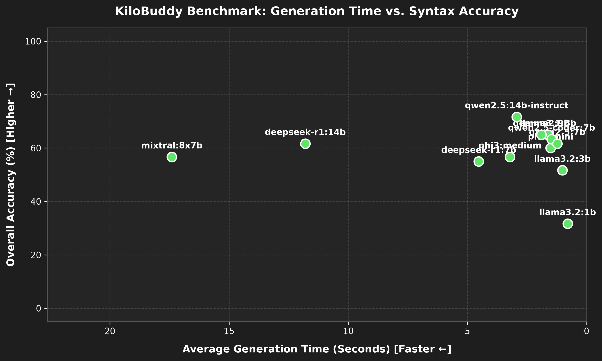
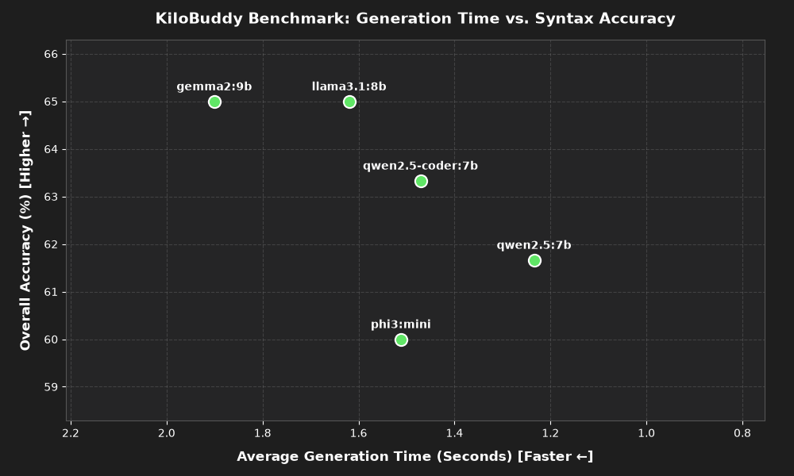

# KiloBuddy

KiloBuddy is a powerful computer assistant that helps users execute commands within their system through voice commands. It utilizes both cloud and local models to generate commands and text blocks that help users with computer issues, summaries, or information. It is designed to run on Windows, Mac, and Linux, and comes with a simple installer to automatically install all dependencies.

## Features

- Voice-controlled computer assistant
- Text-based dashboard
- Cloud and local AI model support
- Automatic command execution with safety framework
- Cross-platform support

## No Privacy Guarantee

KiloBuddy uses cloud and/or local models of your choice. No models are verified for safety or privacy. KiloBuddy does not share any data outside of these services, but your data may be processed by these services. Data privacy is not guaranteed.

## AI Accuracy

KiloBuddy uses AI to process user commands. Only some commands prompt user input. Despite the safety layer in place in KiloBuddy, command accuracy and safety are not guaranteed. By using KiloBuddy, you are accepting the risk of data loss, system corruption, or any other issues that may arise from using KiloBuddy.

## Dependencies
- Python
  - Windows:
    Install [Python 3](https://python.org)
    Check "Add Python to PATH" during installation
  - Mac:
    ```bash
    brew install python
    ```
  - Linux:
    ```bash
    sudo apt update
    sudo apt install python3 python3-pip
    ```
    
    If PyAudio installation fails, run this command (or distribution equivalent):
    ```bash
    sudo apt-get install portaudio19-dev python3-pyaudio
    ```
- (Installed by Installer) PyAudio, Custom Tkinter, Vosk, Google Gemini, OpenAI ChatGPT, Anthropic Claude
## Installation

**1.** Get an API Key
  - Gemini
    - Open [Google AI Studio](https://aistudio.google.com/apikey)
  - ChatGPT
    - Open [OpenAI Platform](https://platform.openai.com/api-keys)
  - Claude
    - Open [Anthropic Console](https://console.anthropic.com/)
  - Sign in with your account
  - Click "Create API key"
  - Copy the API key when it generates

**2.** Download the KiloBuddy zip file from [Releases](https://github.com/MichaelCreel/KiloBuddy/releases)

**3.** Run the install script
  - Windows:
    Run `windows-install.bat`
  - Mac:
    Run `mac-install.command`
  - Linux:
    Run `linux-install.sh`
    - If nothing happens, tkinter is probably missing
      - Install tkinter (or distribution equivalent):
        ```bash
        sudo apt install python3-tk
        ```
      - Or run installer from the terminal:
        ```bash
        python3 Installer.py
        ```
**4.** Paste your API key into the proper input field

**5.** Click "Install"

## Model Notes

The cloud models Google Gemini, OpenAI ChatGPT, and Anthropic Claude are usable cloud models with KiloBuddy. Local models can also be used with KiloBuddy by changing 'AI Provider Preference' in settings. During installation, these local models are provided as viable options:

- Llama 3.1 8B - This is a balanced model created by Meta. It offers good reasoning abilities and instruction following while still being lightweight for mid to higher-range devices. This model is generally intelligent and capable for many tasks.
  - Recommended PC Specs: >16 GB of RAM, 7-16+GB of VRAM

- Qwen 2.5 14B Instruct - This is a large model created by Alibaba. It is designed for instruction following and complex reasoning while not being very conversational. This model is heavier and slower than Llama 3.1 and will require a higher-end system, but it is much better at reasoning and instruction following. This assistant is not very conversational.
  - Recommended PC Specs: >24 GB of RAM, 12-32+ GB of VRAM

While CPU processing is possible with local models, generation will be slow and a discrete video card is recommended for generation.

### Model Tests

These scatter plots below compare the performance of the models. They show the accuracy of the models compared to the time it took for generation. These tests looked at 12 models, and the performance of the recommended models above are supported by the tests.





## Notes

- The prompts for models can be changed by editing `initial_prompt` and `prompt` to tune generation
- Cloud model generation is limited by the number of tokens on your account
- Commands will not be processed if any AI fails to respond
- The app will sometimes be unsuccessful due to the AI model generating invalid syntax
- A dashboard is included for text-based interaction
- Any local model can be used by entering the model name as it appears with `ollama list`

## Issues

Issues should be reported on the [Issues Page](https://github.com/MichaelCreel/KiloBuddy/issues). Make sure to include the issue, repeatable steps to the issue (if possible), the operating system, and whether voice or text was used to send the command.

## Licenses

MIT License
Apache-2.0 License

The KiloBuddy app including the code, installer, icon, prompts, install scripts, etc. are all under MIT License. The speech recognition program and model used in KiloBuddy, Vosk, is licensed under the Apache-2.0 License.
